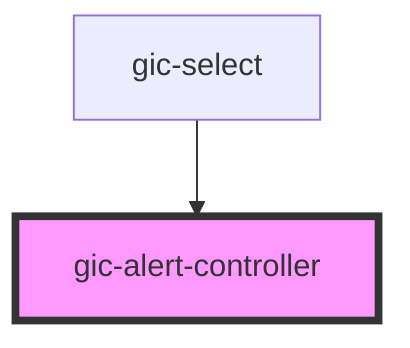

# gic-alert-controller

<!-- Auto Generated Below -->

> **[DEPRECATED]** Use the `alertController` exported from core.

## Methods

### `create(options: AlertOptions) => Promise<HTMLGicAlertElement>`

Create an alert overlay with alert options.

#### Returns

Type: `Promise<HTMLGicAlertElement>`

### `dismiss(data?: any, role?: string | undefined, id?: string | undefined) => Promise<boolean>`

Dismiss the open alert overlay.

#### Returns

Type: `Promise<boolean>`

### `getTop() => Promise<HTMLGicAlertElement | undefined>`

Get the most recently opened alert overlay.

#### Returns

Type: `Promise<HTMLGicAlertElement | undefined>`

## Dependencies

### Used by

 - [gic-select](../select)

### Graph

----------------------------------------------

*Built with [StencilJS](https://stenciljs.com/)*
