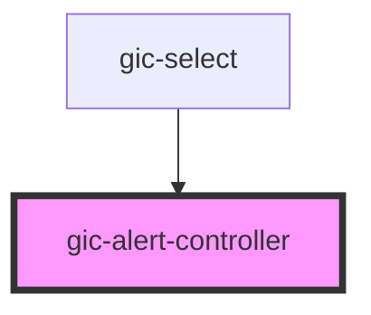

# gic-alert-controller

<!-- Auto Generated Below -->

## Methods

### `create(opts: import("/Users/trik/Projects/gnucoop/gic/core/node_modules/@ionic/core/dist/types/interface").AlertOptions) => Promise<HTMLIonAlertElement>`

Create an alert overlay with alert options

#### Returns

Type: `Promise<HTMLIonAlertElement>`

### `dismiss(data?: any, role?: string | undefined, id?: string | undefined) => Promise<boolean>`

Dismiss the open alert overlay.

#### Returns

Type: `Promise<boolean>`

### `getTop() => Promise<HTMLIonAlertElement | undefined>`

Get the most recently opened alert overlay.

#### Returns

Type: `Promise<HTMLIonAlertElement | undefined>`

## Dependencies

### Used by

 - [gic-select](../select)

### Graph

----------------------------------------------

*Built with [StencilJS](https://stenciljs.com/)*
