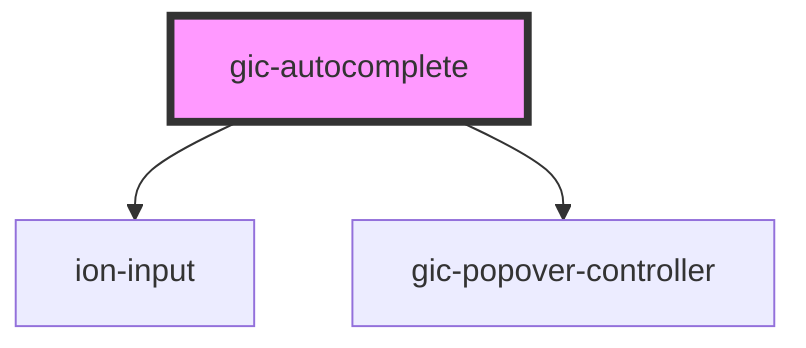

# gic-autocomplete

<!-- Auto Generated Below -->

## Properties

| Property           | Attribute           | Description                                                                                                                                                                            | Type                  | Default     |
| ------------------ | ------------------- | -------------------------------------------------------------------------------------------------------------------------------------------------------------------------------------- | --------------------- | ----------- |
| `interfaceOptions` | `interface-options` | Any additional options that the `popover` interface can take. See the [PopoverController API docs](../../popover/PopoverController/#create) for the create options for each interface. | `any`                 | `{}`        |
| `mode`             | `mode`              | The mode determines which platform styles to use.                                                                                                                                      | `"ios" \| "md"`       | `undefined` |
| `placeholder`      | `placeholder`       |                                                                                                                                                                                        | `string \| undefined` | `undefined` |
| `value`            | `value`             |                                                                                                                                                                                        | `null \| string`      | `null`      |

## Dependencies

### Depends on

- ion-input
- [gic-popover-controller](../popover-controller)

### Graph

----------------------------------------------

*Built with [StencilJS](https://stenciljs.com/)*
