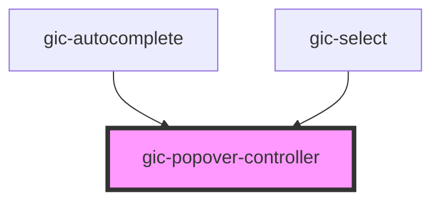

# gic-popover-controller

Popover controllers programmatically control the popover component. Popovers can be created and dismissed from the popover controller. View the [Popover](../popover) documentation for a full list of options to pass upon creation.


<!-- Auto Generated Below -->


> **[DEPRECATED]** Use the `popoverController` exported from core.

## Usage

### Javascript

```javascript
async function presentPopover() {
  const popoverController = document.querySelector('gic-popover-controller');
  await popoverController.componentOnReady();

  const popoverElement = await popoverController.create({
    component: 'profile-page',
    event: event
  });
  return await popoverElement.present();
}
```


## Methods

### `create(options: any) => Promise<HTMLGicPopoverElement>`

Create a popover overlay with popover options.

#### Returns

Type: `Promise<HTMLGicPopoverElement>`


### `dismiss(data?: any, role?: string | undefined, id?: string | undefined) => Promise<boolean>`

Dismiss the open popover overlay.

#### Returns

Type: `Promise<boolean>`


### `getTop() => Promise<HTMLGicPopoverElement | undefined>`

Get the most recently opened popover overlay.

#### Returns

Type: `Promise<HTMLGicPopoverElement | undefined>`


## Dependencies

### Used by

 - [gic-autocomplete](../autocomplete)
 - [gic-select](../select)

### Graph


----------------------------------------------

*Built with [StencilJS](https://stenciljs.com/)*
